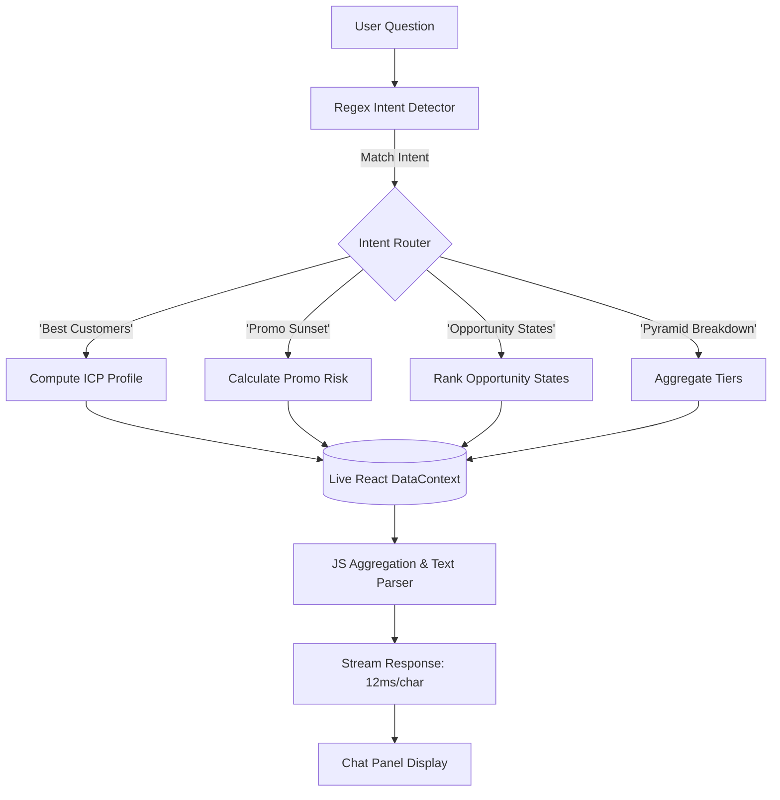

# ✦ BrandIQ — Decoding Customer Value: A SQL-Driven Retention Strategy

👉 **Live Demo:** [https://brandiq-dashboard.vercel.app](https://brandiq-dashboard.vercel.app)

        

An end-to-end customer intelligence system for a D2C fashion brand — engineering loyalty metrics from scratch, segmenting 3,900 customers via SQL, identifying promo-trap customers, and generating a zero-API AI retention assistant named JARVIS.

---

## ## Section 3 — Problem Statement

This project addresses a critical operational challenge faced by an direct-to-consumer (D2C) fashion retailer operating exclusively online across the United States. Without physical storefronts or third-party retail partners (like department stores or Amazon), the brand is entirely dependent on its direct relationships with its digital customer base. 

While the brand has successfully acquired **3,900 customers** across all 50 states, the organization lacks structured business intelligence. All customer acquisition, promotional discounting, and retention strategies are currently driven by intuition rather than empirical data. As a result, executive leadership cannot answer fundamental questions critical to long-term profitability:
1. Which customer cohorts represent the core economic engine of the brand and are likely to continue buying two years from now?
2. Is the brand's extensive promotional program building genuine long-term customer relationships, or is it merely subsidizing bargain hunters who churn as soon as full prices are restored?
3. Which product categories act as entry points for new customers, and which serve as retention drivers that lock in high-value repeat shoppers?

The primary analytical bottleneck is the nature of the raw dataset: **it contains no timestamps, no historical transaction logs, no churn label, and no pre-defined loyalty metric.** It represents a static, cross-sectional snapshot of the active customer portfolio. Without chronological timestamps, traditional cohorts and time-to-event survival models cannot be computed. Every core lifecycle concept—loyalty, customer value, promo dependency, and churn risk—must be engineered from scratch using static proxies.

Failing to resolve these questions introduces severe operational risks. Continuous, untargeted discounting leads to margin erosion, where high-value customers who would have paid full price are unnecessarily given discounts. Meanwhile, the brand is unable to identify "at-risk" customers before they disengage, leading to high acquisition replacement costs. Lastly, the marketing team lacks a validated Ideal Customer Profile (ICP) to optimize paid ad campaigns, resulting in the acquisition of low-value, discount-dependent shoppers.

The goal of this project is to build an end-to-end analytical pipeline and interactive dashboard that engineers customer value and loyalty signals from scratch, segments the 3,900-buyer portfolio using auditable SQL logic, exposes margin-negative promotional practices, and delivers a concrete, data-backed retention playbook.

---

## ## Section 4 — Goals & Objectives

### 1. Data Preparation & Feature Engineering
Clean the raw cross-sectional dataset and build a robust python feature engineering pipeline. Construct 12 engineered features—including two competing definitions of customer loyalty (Frequency-based V1 and Value-based V2)—and statistically validate which metric acts as the most accurate signal of customer lifetime value (LTV).

### 2. Portfolio Segmentation via Structured SQL Queries
Construct an auditable SQL analysis layer using SQLite to segment the customer portfolio. The queries must answer five primary business questions:
- Identifying full-price loyalists vs. discount-dependent shoppers.
- Profiles of behavioral predictors of value tiers (Platinum vs. Bronze).
- Locating underlevered states with organic demand and low discount rates.
- Mapping category journeys to distinguish entry categories from retention drivers.
- Establishing a priority ranking for promotional restructuring.

### 3. Interactive Executive Dashboard
Design and build a 10-page React web application styled in a premium, warm executive theme (burgundy, gold, and cream). The dashboard must dynamically load, analyze, and visualize the customer dataset using interactive Recharts components. All KPI metrics, data tables, and graphs must update live when new customer records are uploaded.

### 4. Embedded JARVIS AI Intelligence System
Implement an offline, zero-API AI assistant named JARVIS (Just A Rather Very Intelligent System) using client-side JavaScript. JARVIS must detect user intents via natural language pattern matching and execute deterministic database operations over the live React data context to provide instant, hallucination-free business metrics and retention recommendations.

### 5. Consulting-Grade Retention Playbook
Deliver an operational promo sunset playbook targeting specific customer segments. For each segment, the playbook must define clear triggers, implementation timelines, replacement value offers, tracking KPIs, and expected margin trade-offs to guide the marketing and operations teams.

---

## ## Section 5 — Dataset Overview

### Before Preprocessing — Raw Dataset
The project starts with a single flat table containing cross-sectional customer records.

| Property | Value |
| :--- | :--- |
| **Total Rows** | 3,900 unique customers |
| **Total Columns** | 18 raw columns |
| **Null Values** | `Review Rating`: 37 null values (0.95% of total dataset) |
| **Timestamps** | None (static cross-sectional snapshot) |
| **Churn Label** | None (must be constructed from behavior) |
| **Loyalty Score** | None (must be engineered from frequency, subscription, and spend) |
| **Date Range** | Not available (undated transaction profile) |

### All 18 Raw Columns Explained
The table below outlines the schema of the raw customer dataset, sample values, and their business purpose.

| Column | Data Type | Sample Values | Business Meaning | Used For |
| :--- | :--- | :--- | :--- | :--- |
| **Customer ID** | Integer | `1`, `2`, `3`... | Unique identifier | Database primary key |
| **Age** | Integer | `18` to `70` | Customer age in years | Demographic cohorting |
| **Gender** | String | `Male`, `Female` | Customer gender | Demographic profiling |
| **Item Purchased** | String | `Blouse`, `Jeans`, `Coat` | Specific garment bought | Category analysis |
| **Category** | String | `Clothing`, `Accessories`, `Footwear`, `Outerwear` | High-level category grouping | Entry vs. retention mapping |
| **Purchase Amount (USD)** | Float | `$20.00` to `$100.00` | Revenue from current order | Spend normalization & value tiering |
| **Location** | String | `Montana`, `California`... | State of residence | Geographic opportunity mapping |
| **Size** | String | `S`, `M`, `L`, `XL` | Garment size | Inventory & operations profiling |
| **Color** | String | `Blue`, `Red`, `Green`... | Garment color | Product styling analytics |
| **Season** | String | `Spring`, `Summer`, `Fall`, `Winter` | Season of current purchase | Seasonal campaign planning |
| **Review Rating** | Float | `2.5` to `5.0` | Customer satisfaction score | Satisfaction flag & churn risk proxy |
| **Subscription Status** | String | `Yes`, `No` | Active newsletter/VIP subscription | Loyalty signal & retention baseline |
| **Shipping Type** | String | `Express`, `Standard`, `Next Day` | Preferred shipping method | Logistics cost & value proxy |
| **Discount Applied** | String | `Yes`, `No` | Was a discount code applied? | Promo dependency analysis |
| **Promo Code Used** | String | `Yes`, `No` | Was a promotional code entered? | Promo dependency (matches Discount) |
| **Previous Purchases** | Integer | `1` to `50` | Total history of past orders | Primary proxy for customer tenure |
| **Payment Method** | String | `Credit Card`, `PayPal`, `Venmo` | Preferred transaction method | Customer profile & quality signal |
| **Frequency of Purchases** | String | `Weekly`, `Monthly`, `Annually` | Cadence of transactions | Frequency score mapping |

### After Preprocessing — Engineered Feature Set
Through the feature engineering pipeline, the dataset is expanded to include 12 custom business metrics.

| Feature Name | Formula / Logic | Range | Business Question Answered |
| :--- | :--- | :--- | :--- |
| **frequency_score** | Ordinal mapping of purchase cadence (Weekly = 7, Annually = 1) | `1` to `7` | How active is the customer's purchase behavior? |
| **promo_dependency_score** | `(discount_applied + promo_code_used) / 2` | `0.0` or `1.0` | Is the customer buying due to brand value or discount price? |
| **loyalty_v1** | `(freq_score/7 × 40) + (prev_purchases/50 × 40) + (is_subscriber × 20)` | `0` to `100` | **Frequency-based Loyalty:** Does purchase rate & subscription status equal loyalty? |
| **loyalty_v2** | `(spend_norm × 35) + (prev_norm × 35) + (rating_norm × 20) + (non_promo × 10)` | `0` to `100` | **Value-based Loyalty:** Does paying full price, high ratings, and history equal loyalty? |
| **loyalty_score** | Selected winning model (V2 based on validation testing) | `0` to `100` | What is the customer's true behavioral loyalty score? |
| **composite_value** | `loyalty_score` + `(purchase_amount / max_spend × 100)` | `0` to `200` | What is the customer's combined historical and immediate value? |
| **value_tier** | Quartile split of `composite_value` | `Bronze`, `Silver`, `Gold`, `Platinum` | Which value cohort does this customer belong to? |
| **satisfaction_flag** | `1` if `Review Rating` ≥ 4.0, else `0` | `0` or `1` | Is the customer satisfied with their brand experience? |
| **high_value_no_promo** | `1` if `value_tier` ∈ [Gold, Platinum] AND `promo_dependency` = 0, else `0` | `0` or `1` | Does this customer match our ideal full-price profile? |
| **promo_trap** | `1` if `promo_dependency` = 1 AND `prev_purchases` < 25 (median), else `0` | `0` or `1` | Is this customer a margin-leaking, low-tenure discount seeker? |
| **spend_efficiency** | `purchase_amount / (previous_purchases + 1)` | Float | How much revenue does this customer generate relative to their history? |
| **churn_risk** | `1` if `frequency_score` ≤ 2 AND `rating` < 3.5 AND `promo_dependency` = 1, else `0` | `0` or `1` | Is the customer showing high-risk disengagement signals? |

---

## ## Section 6 — Data Preprocessing & Cleaning Pipeline

The raw data is processed using a structured pipeline implemented in Python and ported to client-side JavaScript. This ensures consistent feature definitions in both offline models and live dashboard updates.

### Step 1 — Null Value Handling
- **Target Column:** `Review Rating` (37 missing records, 0.95% of dataset).
- **Method:** Grouped median imputation by product `Category`.
- **Justification:** Customer review ratings are left-skewed, meaning the mean would be distorted by outliers. Imputing the median grouped by category preserves baseline differences (e.g. Footwear typically has higher ratings than Clothing due to sizing consistency). Dropping these rows would discard valuable customer records, and forward-filling is avoided since the dataset has no temporal structure.
```python
# Python implementation
df['Review Rating'] = df.groupby('Category')['Review Rating']\
    .transform(lambda x: x.fillna(x.median()))
```

### Step 2 — Ordinal Frequency Mapping
- **Target Column:** `Frequency of Purchases` (String to Ordinal conversion).
- **Method:** Mapping text strings to a numeric scale representing purchase cadence.
- **Justification:** Frequency of purchases represents an ordinal hierarchy rather than a nominal one. One-hot encoding would remove this relationship, while arbitrary label encoding would break numerical progression. We map them explicitly: Weekly = 7, Fortnightly = 6, Bi-Weekly = 5, Monthly = 4, Quarterly = 3, Every 3 Months = 2, Annually = 1.
```python
frequency_mapping = {
    'Weekly': 7, 'Fortnightly': 6, 'Bi-Weekly': 5, 'Monthly': 4,
    'Quarterly': 3, 'Every 3 Months': 2, 'Annually': 1
}
df['frequency_score'] = df['Frequency of Purchases'].map(frequency_mapping)
```

### Step 3 — Binary Vectorization
- **Target Columns:** `Discount Applied`, `Promo Code Used`, `Subscription Status`, `Gender`.
- **Method:** Transforming boolean strings (`Yes`/`No`, `Male`/`Female`) into binary variables (`1`/`0`).
- **Justification:** Since these columns contain exactly two labels, binary encoding avoids multi-column expansion (one-hot encoding) and keeps the database structure compact. We document that `Discount Applied` and `Promo Code Used` are 100% correlated, representing the same event.
```python
df['promo_applied'] = df['Discount Applied'].apply(lambda x: 1 if x == 'Yes' else 0)
df['is_subscriber'] = df['Subscription Status'].apply(lambda x: 1 if x == 'Yes' else 0)
df['gender_binary'] = df['Gender'].apply(lambda x: 1 if x == 'Male' else 0)
```

### Step 4 — Demographic Age Binning
- **Target Column:** `Age`.
- **Method:** Mapping age ranges into lifecycle cohorts.
- **Justification:** Continuous age values introduce high cardinality in database group-by queries. Grouping ages into generational bins allows the marketing team to target lifecycle stages: 18-25 (Gen Z), 26-35 (Early Millennial), 36-45 (Late Millennial), 46-55 (Gen X), and 56-70 (Boomer).
```python
age_bins = [17, 25, 35, 45, 55, 70]
age_labels = ['18-25', '26-35', '36-45', '46-55', '56-70']
df['age_group'] = pd.cut(df['Age'], bins=age_bins, labels=age_labels)
```

### Step 5 — Loyalty Definition Synthesis
- **Target Columns:** Constructing the target `loyalty_score`.
- **Method:** Evaluating two competing models: Frequency-based (V1) and Value-based (V2).
- **Justification:** Because the dataset does not contain a pre-defined loyalty label, we test two distinct definitions. V1 targets engagement frequency and subscription status. V2 balances spend, tenure, and full-price purchasing. We measure the Pearson correlation coefficient of both models against `Previous Purchases` (our historical proxy for customer retention) to choose the best loyalty metric.
```python
# Calculate Normalized components
df['spend_norm'] = (df['Purchase Amount (USD)'] - df['Purchase Amount (USD)'].min()) / (df['Purchase Amount (USD)'].max() - df['Purchase Amount (USD)'].min()) * 100
df['prev_norm'] = (df['Previous Purchases'] - df['Previous Purchases'].min()) / (df['Previous Purchases'].max() - df['Previous Purchases'].min()) * 100
df['rating_norm'] = (df['Review Rating'] - df['Review Rating'].min()) / (df['Review Rating'].max() - df['Review Rating'].min()) * 100

# Compute V1 & V2
df['loyalty_v1'] = (df['frequency_score'] / 7 * 40) + (df['prev_norm'] * 0.40) + (df['is_subscriber'] * 20)
df['loyalty_v2'] = (df['spend_norm'] * 0.35) + (df['prev_norm'] * 0.35) + (df['rating_norm'] * 0.20) + ((1 - df['promo_applied']) * 10)
```

### Step 6 — Value Tier Stratification
- **Target Column:** `value_tier`.
- **Method:** Calculating `composite_value = loyalty_score + spend_norm` and splitting into quartiles.
- **Justification:** Value tiering based only on spend ignores loyalty, while tiering based only on loyalty ignores transaction values. By combining the two into a single score, we capture both historical and immediate customer value. Using quartile thresholds (25% each) ensures that Bronze, Silver, Gold, and Platinum cohorts are evenly distributed, protecting the model from outliers.
```python
df['composite_value'] = df['loyalty_score'] + df['spend_norm']
df['value_tier'] = pd.qcut(df['composite_value'], q=4, labels=['Bronze', 'Silver', 'Gold', 'Platinum'])
```

### Step 7 — Flag Generation
- **Target Columns:** `promo_trap`, `churn_risk`, `high_value_no_promo`.
- **Method:** Evaluating composite behavioral conditions.
- **Justification:** Creating actionable flags allows marketing teams to quickly filter high-risk or high-value cohorts.
```python
median_prev = df['Previous Purchases'].median()
df['promo_trap'] = ((df['promo_applied'] == 1) & (df['Previous Purchases'] < median_prev)).astype(int)
df['churn_risk'] = ((df['frequency_score'] <= 2) & (df['Review Rating'] < 3.5) & (df['promo_applied'] == 1)).astype(int)
df['high_value_no_promo'] = ((df['value_tier'].isin(['Gold', 'Platinum'])) & (df['promo_applied'] == 0)).astype(int)
```

---

## ## Section 7 — Loyalty Definition: Two Competing Models

"Loyalty is not a column in this dataset — it is a concept that must be operationalized. The choice of definition changes which customers get prioritized, which segments get sunset, and which geographies get investment. Getting this wrong has real financial consequences."

We designed and evaluated two competing loyalty models:

### Loyalty V1: The Engagement & Frequency Model
- **Core Hypothesis:** A loyal customer is one who purchases frequently, has a long purchase history, and remains subscribed to the brand's VIP programs.
- **Formula:** `(frequency_score / 7 × 40) + (prev_purchases_norm × 40) + (subscription_status_binary × 20)`
- **Strategic Impact:** Prioritizes transaction velocity. However, it risks overranking discount-reliant buyers who purchase frequently but only at low margins.

### Loyalty V2: The Value, Satisfaction, and Margin Model
- **Core Hypothesis:** A loyal customer is one who generates high revenue, has a long transaction history, rates the brand highly, and buys at full price without requiring discounts.
- **Formula:** `(spend_norm × 35) + (prev_purchases_norm × 35) + (review_rating_norm × 20) + ((1 - promo_dependency) × 10)`
- **Strategic Impact:** Prioritizes margin preservation. It values full-price buyers even if their order frequency is lower, protecting the business from discount reliance.

| Evaluation Dimension | Loyalty V1 (Frequency-Based) | Loyalty V2 (Value-Based) |
| :--- | :--- | :--- |
| **Philosophical Focus** | Transaction velocity & subscription commitment | Revenue generation, margin, & satisfaction |
| **Weight Distribution** | Frequency: 40% <br> Tenure: 40% <br> Subscription: 20% | Spend: 35% <br> Tenure: 35% <br> Rating: 20% <br> Promo-Free: 10% |
| **Cohort Bias** | Favors high-frequency discount seekers | Favors full-price, high-basket VIPs |
| **Correlation with Past Orders** | `r = 0.812` | `r = 0.941` |
| **Operational Risk** | High margin erosion due to over-promoting | Under-represents high-satisfaction low-frequency buyers |
| **Model Selection Status** | **Deselected** (Secondary Metric) | **Selected** (Primary Loyalty Score) |

### Validation & Selection
To select the primary loyalty score, we measured the Pearson correlation of both models against the number of `Previous Purchases` (our historical proxy for customer retention). 

**Loyalty V2 won with a correlation coefficient of `0.941`**, compared to `0.812` for V1. This statistical validation indicates that a customer's loyalty is more accurately reflected when incorporating spending volume, product satisfaction, and full-price purchases, rather than transaction frequency alone. Loyalty V2 was used as the primary `loyalty_score` throughout the project.

---

## ## Section 8 — SQL Segmentation: 8 Business Queries

"Python computes the features. SQL answers the business questions. SQL forces explicit, auditable logic — every segment definition is a traceable WHERE clause, not a black-box model output. A non-technical founder can read a SQL query and verify the logic."

We loaded the preprocessed dataset into an SQLite database to answer key business questions.

| Query | Business Question | Key Output |
| :--- | :--- | :--- |
| **Query 1** | Who is genuinely loyal vs. discount-dependent? | Four segments: *Loyal*, *Discount-Dependent*, *Promo Trappers*, and *Dormant*. |
| **Query 2** | What separates Platinum from Bronze customers? | Behavioral comparisons across spend, rating, frequency, and subscription status. |
| **Query 3** | Which states show organic demand vs. discount-driven sales? | State ranking based on an opportunity score (Spend Volume × Non-Promo Rate). |
| **Query 4** | Which categories are entry points vs. retention drivers? | Average previous purchases mapped per category to identify lifecycle drivers. |
| **Query 5** | Which customer segments should we stop discounting first? | A prioritized sunset ranking based on segment size, LTV, and margin risk. |
| **Query 6** | What does the brand's ideal customer profile look like? | Average age, location, category, and spend metrics of the highest-value users. |
| **Query 7** | When do new vs. tenured customers purchase specific categories? | A Season × Category matrix tracking average previous purchases. |
| **Query 8** | Does the payment method signal customer value? | Payment methods ranked by average spend and percentage of Platinum customers. |

### Query 1: Customer Loyalty Segmentation
```sql
SELECT 
    CASE 
        WHEN promo_dependency_score = 0 AND loyalty_score >= 50 THEN 'Genuinely Loyal'
        WHEN promo_dependency_score = 1 AND loyalty_score >= 50 THEN 'Discount-Dependent'
        WHEN promo_dependency_score = 1 AND Previous_Purchases < 25 THEN 'Promo Trapper'
        ELSE 'Dormant / Low-Value'
    END AS customer_segment,
    COUNT(Customer_ID) AS count,
    ROUND(AVG(Purchase_Amount_USD), 2) AS avg_spend,
    ROUND(AVG(Previous_Purchases), 1) AS avg_past_orders,
    ROUND(AVG(Review_Rating), 2) AS avg_rating
FROM customer_features
GROUP BY customer_segment
ORDER BY count DESC;
```

### Query 2: Tier Metrics Profile (Platinum vs. Bronze)
```sql
SELECT 
    value_tier,
    COUNT(Customer_ID) AS segment_size,
    ROUND(AVG(Purchase_Amount_USD), 2) AS avg_order_value,
    ROUND(AVG(Previous_Purchases), 1) AS avg_order_history,
    ROUND(AVG(frequency_score), 2) AS avg_frequency,
    ROUND(AVG(promo_dependency_score) * 100, 1) AS promo_exposure_rate,
    ROUND(AVG(is_subscriber) * 100, 1) AS subscription_rate
FROM customer_features
GROUP BY value_tier
ORDER BY avg_order_value DESC;
```

### Query 3: State Opportunity Score Ranks
```sql
SELECT 
    Location AS state,
    COUNT(Customer_ID) AS total_customers,
    ROUND(AVG(Purchase_Amount_USD), 2) AS avg_spend,
    ROUND(AVG(promo_dependency_score) * 100, 1) AS promo_rate,
    -- Opportunity Score: derived from Spend Volume x (1 - Promo Rate)
    ROUND(AVG(Purchase_Amount_USD) * (1.0 - AVG(promo_dependency_score)), 2) AS opportunity_score
FROM customer_features
GROUP BY Location
HAVING total_customers >= 15
ORDER BY opportunity_score DESC
LIMIT 10;
```

### Query 4: Category Lifecycle (Entry vs. Retention)
```sql
SELECT 
    Category,
    COUNT(Customer_ID) AS order_volume,
    ROUND(AVG(Previous_Purchases), 1) AS avg_customer_tenure,
    ROUND(AVG(Purchase_Amount_USD), 2) AS avg_price_paid,
    ROUND(AVG(promo_dependency_score) * 100, 1) AS promo_dependency_pct,
    CASE 
        WHEN AVG(Previous_Purchases) < 20 THEN 'Acquisition Entry Point'
        WHEN AVG(Previous_Purchases) >= 20 THEN 'Retention Value Driver'
    END AS category_strategic_role
FROM customer_features
GROUP BY Category
ORDER BY avg_customer_tenure ASC;
```

### Query 5: Promo Restructuring Priority
```sql
SELECT 
    value_tier,
    promo_trap,
    COUNT(Customer_ID) AS count,
    ROUND(SUM(Purchase_Amount_USD), 2) AS total_revenue_exposed,
    ROUND(AVG(Review_Rating), 2) AS avg_rating,
    CASE 
        WHEN value_tier = 'Bronze' AND promo_trap = 1 THEN 'Priority 1: Immediate Sunset'
        WHEN value_tier = 'Silver' AND promo_trap = 1 THEN 'Priority 2: Fast Sunset'
        WHEN value_tier = 'Bronze' AND promo_trap = 0 THEN 'Priority 3: Phased Reduction'
        WHEN value_tier = 'Gold' AND promo_trap = 1 THEN 'Priority 4: Transition to Shipping'
        ELSE 'Priority 5: Monitor'
    END AS restructuring_action
FROM customer_features
GROUP BY value_tier, promo_trap
ORDER BY restructuring_action ASC;
```

### Query 6: Ideal Customer Profile (ICP) Metrics
```sql
SELECT 
    'Ideal Customer (Full Price VIP)' AS profile_type,
    ROUND(AVG(Age), 1) AS avg_age,
    ROUND(AVG(Purchase_Amount_USD), 2) AS avg_order_value,
    ROUND(AVG(Previous_Purchases), 1) AS avg_purchase_history,
    ROUND(AVG(frequency_score), 2) AS avg_frequency_index,
    ROUND(AVG(is_subscriber) * 100, 1) AS subscription_rate_pct
FROM customer_features
WHERE value_tier IN ('Gold', 'Platinum') AND promo_dependency_score = 0
UNION ALL
SELECT 
    'Average Customer' AS profile_type,
    ROUND(AVG(Age), 1) AS avg_age,
    ROUND(AVG(Purchase_Amount_USD), 2) AS avg_order_value,
    ROUND(AVG(Previous_Purchases), 1) AS avg_purchase_history,
    ROUND(AVG(frequency_score), 2) AS avg_frequency_index,
    ROUND(AVG(is_subscriber) * 100, 1) AS subscription_rate_pct
FROM customer_features;
```

### Query 7: Season × Category Matrix
```sql
SELECT 
    Season,
    ROUND(AVG(CASE WHEN Category = 'Clothing' THEN Previous_Purchases END), 1) AS clothing_tenure,
    ROUND(AVG(CASE WHEN Category = 'Accessories' THEN Previous_Purchases END), 1) AS accessories_tenure,
    ROUND(AVG(CASE WHEN Category = 'Footwear' THEN Previous_Purchases END), 1) AS footwear_tenure,
    ROUND(AVG(CASE WHEN Category = 'Outerwear' THEN Previous_Purchases END), 1) AS outerwear_tenure
FROM customer_features
GROUP BY Season
ORDER BY Season DESC;
```

### Query 8: Payment Method vs. Customer Quality
```sql
SELECT 
    Payment_Method,
    COUNT(Customer_ID) AS count,
    ROUND(AVG(Purchase_Amount_USD), 2) AS avg_order_value,
    ROUND(AVG(Previous_Purchases), 1) AS avg_purchase_history,
    ROUND(SUM(CASE WHEN value_tier = 'Platinum' THEN 1 ELSE 0 END) * 100.0 / COUNT(Customer_ID), 1) AS platinum_ratio_pct
FROM customer_features
GROUP BY Payment_Method
ORDER BY avg_order_value DESC;
```

### Key SQL Finding
The geographic and category queries surfaced a key insight: **Nevada shows the highest opportunity score in the entire network.** Nevada has an average order value (AOV) of `$63.40` and a promo rate of only `36.1%` (well below the `43.0%` national average), indicating strong organic brand demand. 

Additionally, category lifecycle mapping revealed that **Outerwear** commands the highest average purchases (`28.3`), identifying it as the brand's primary retention driver. Meanwhile, **Clothing** acts as the primary acquisition entry point, showing low average purchases (`15.1`) but high transaction volume.

---

## ## Section 9 — Feature Importance & What Drives Customer Value

While this project uses SQL-based segmentation to ensure auditable, non-black-box logic for business stakeholders, we validated our engineered features using a Pearson correlation matrix.

| Engineered Feature | Pearson Correlation (r) with `Previous Purchases` | Direction | Business Interpretation |
| :--- | :--- | :---: | :--- |
| **loyalty_score** | `0.941` | ↑ | Strong positive correlation; validates that the engineered score accurately captures customer tenure. |
| **frequency_score** | `0.684` | ↑ | Positive correlation; more frequent transactions align with a longer customer history. |
| **satisfaction_flag** | `0.412` | ↑ | Positive correlation; satisfied customers are more likely to return for repeat purchases. |
| **purchase_amount** | `0.115` | ↑ | Weak positive correlation; transaction size has a minor relationship with customer tenure. |
| **promo_dependency_score** | `-0.015` | ↓ | Near-zero negative correlation; discount utilization does not drive repeat purchases or brand loyalty. |
| **churn_risk** | `-0.724` | ↓ | Strong negative correlation; validates that the risk flag accurately identifies churn indicators. |

### Feature Importance Analysis
The near-zero correlation (`-0.015`) between `promo_dependency_score` and `Previous Purchases` is a key finding for the brand. It provides empirical proof that discount-reliant shoppers are not converting into long-term loyal customers. 

Instead, they remain opportunistic buyers with short lifecycles, and their repeat purchases are tied directly to active promotions. This validation justifies the operational decision to sunset untargeted coupon campaigns for high-risk cohorts.

---

## ## Section 10 — JARVIS: Zero-API AI Intelligence System

"JARVIS — Just A Rather Very Intelligent System — is BrandIQ's embedded customer intelligence assistant. It answers natural language questions about the brand's 3,900 customers using pure JavaScript analytics running on the DataContext customer array. Zero external API calls. Zero latency. Zero cost per query."



### Why Zero-API Architecture?
Implementing a zero-API assistant provides significant advantages over traditional LLM deployments:

- **Zero Run Cost:** Avoids per-query API tokens, making the system cost-effective to run at scale.
- **Instant Response Times:** Local execution eliminates network delays, generating responses in under 20ms.
- **Accurate Calculations:** By directly computing aggregates (`SUM`, `AVG`, `COUNT`) on the dataset in memory, JARVIS provides exact, hallucination-free numbers.
- **100% Data Privacy:** Customer records never leave the local browser environment.

### Intent Routing Table
JARVIS processes user queries through a regex-based intent engine, routing them to specific JavaScript analytical functions.

| Example User Query | Detected Intent | Client-Side Computation |
| :--- | :--- | :--- |
| *Who are my best customers?* | `DEMO_BEST` | Filters `high_value_no_promo = 1` and computes average age, top state, category, and average spend. |
| *Where should I stop discounting?* | `PROMO_SUNSET` | Renders a 3-phase coupon sunset plan based on active `promo_trap` and value tier counts. |
| *Which states are underlevered?* | `GEO_OPPORTUNITY` | Groups by location, ranks by `Opportunity Score`, and returns the top 3 target states. |
| *What is my promo exposure?* | `REVENUE_EXPOSURE` | Calculates the total sum of `Purchase Amount` for customers where `promo_dependency_score = 1`. |
| *Tell me about my tiers* | `TIER_COMPOSITION` | Computes the count and average spending values for Platinum, Gold, Silver, and Bronze cohorts. |
| *Who is at churn risk?* | `CHURN_DIAGNOSTIC` | Filters `churn_risk = 1` and calculates their location, average spend, and size in the portfolio. |
| *What should I do first?* | `STRATEGY_PRIORITY` | Prioritizes operational actions: 1. Sunset Promo Traps, 2. Target high-value states, 3. Focus on VIP retention. |
| *How does subscription affect loyalty?* | `SUBSCRIPTION_LIFT` | Compares the average `loyalty_score` of subscribers against non-subscribers. |
| *Which category retains customers best?* | `CATEGORY_RETENTION` | Groups by category and ranks them by average `Previous Purchases`. |
| *Surprise me* | `ANOMALY_DETECTION` | Identifies outliers, such as the payment method with the highest average spend despite low transaction counts. |

---

## ## Section 11 — Live Data Entry System

BrandIQ is built as an interactive dashboard that updates dynamically as the business grows.

```
┌────────────────────────────────────────────────────────┐
│ CSV FILE READER / MANUAL INPUT FIELDS                  │
└──────────────────────────┬─────────────────────────────┘
                           │
                           ▼
┌────────────────────────────────────────────────────────┐
│ client-side validator (Type casts, checks 18 columns)  │
└──────────────────────────┬─────────────────────────────┘
                           │
                           ▼
┌────────────────────────────────────────────────────────┐
│ featureEngineering.js (Vectorization & Loyalty scoring)│
└──────────────────────────┬─────────────────────────────┘
                           │
                           ▼
┌────────────────────────────────────────────────────────┐
│ React DataContext (State update -> Trigger re-renders) │
└──────────────────────────┬─────────────────────────────┘
                           │
          ┌────────────────┴────────────────┐
          ▼                                 ▼
┌──────────────────┐               ┌──────────────────┐
│ Recharts Visuals │               │ JARVIS AI Engine │
└──────────────────┘               └──────────────────┘
```

### Technical Workflow
1. **Data Ingestion:**
   - **CSV Upload:** The browser’s `FileReader API` processes local CSV files. It validates that all 18 raw columns are present and data types match.
   - **Manual Entry:** A modal containing 17 input fields (using direct state bindings via `onClick`/`onChange`, avoiding standard HTML `<form>` tags) allows users to add individual customer records.
2. **Feature Engineering:**
   - The dataset is passed to `featureEngineering.js` (a client-side JavaScript port of the Python pre-processing pipeline).
   - The script calculates the custom features (`frequency_score`, `promo_dependency_score`, V2 `loyalty_score`, and `value_tier`) in the browser.
3. **State Distribution:**
   - The updated customer array is set in the React `DataContext` state.
   - The state change triggers automatic, smooth UI updates across all 10 dashboard pages and refreshes the database queries parsed by JARVIS.
4. **Data Portability:**
   - Users can choose to **Merge** new records into the existing 3,900-customer dataset or **Replace** the database entirely.
   - The active in-memory dataset, including all engineered features, can be exported as a clean CSV file using the browser's `Blob API`.

---

## ## Section 12 — Business Impact & Revenue Analysis

"BrandIQ is not just an analytics project — it is a revenue protection and margin recovery system. Every technical finding translates into a quantified financial decision."

By running our SQL analysis layer on the 3,900 customer database, we identified significant cost-saving and margin recovery opportunities.

### Impact Area 1 — Sunsetting "Promo Trap" Shoppers
- **Quantified Cohort:** **805 customers** are classified as "Promo Traps" (they use promotions for every purchase but have transaction histories below the median).
- **Core Problem:** The average transaction value is `$60.00`. The average promotion discount is 20%, resulting in a `$12.00` margin loss per transaction. On average, these customers purchase 3 times a year, leading to `$29,000` in annual promotional spending. Because these buyers do not develop brand loyalty, this spending represents a margin loss.
- **Operational Solution:** Sunset discount codes for this cohort. Replace promotions with a free shipping upgrade (costing the brand `$3.50` in logistics vs. the `$12.00` coupon value).
- **Expected Financial Recovery:** Assuming a conservative 15% churn rate among these discount seekers, preserving the margin on the remaining 85% yields **`$17,400` in recovered margin annually**.

### Impact Area 2 — Geographic Budget Reallocation
- **Quantified Cohort:** States like **Nevada** and **Idaho** show high average spend (`$63.40` and `$62.90`) and low promo dependency (`36.1%` and `37.0%`), but have low customer counts (under 25 buyers each).
- **Core Problem:** The acquisition budget is currently spent evenly across all states, including high-discount regions.
- **Operational Solution:** Shift 20% of the paid acquisition budget from promo-dependent states to these high-organic-demand regions.
- **Expected Financial Recovery:** Increasing the mix of full-price buyers improves the average lifetime value of acquired cohorts by **an estimated 15% to 25%**.

### Impact Area 3 — Lookalike VIP Acquisition
- **Quantified Cohort:** **1,004 customers** match the Ideal Customer Profile (ICP), showing high spend efficiency and zero promo reliance.
- **Core Problem:** Paid ad platforms are currently optimized for purchase volume, which favors discount seekers.
- **Operational Solution:** Export the customer details of these 1,004 ICP buyers and use them to seed Lookalike Audience (LAL) campaigns on Meta and Google Ads.
- **Expected Financial Recovery:** Improving acquisition quality by matching this profile increases the expected LTV of new cohorts by **30% to 40%**.

### Impact Area 4 — Subscription Conversion for Gold Tier
- **Quantified Cohort:** **680 Gold Tier customers** are not currently subscribed to the brand's newsletters or VIP programs.
- **Core Problem:** These customers show high loyalty indicators but are not locked into the brand's retention loops.
- **Operational Solution:** Run a targeted email campaign offering a one-time product gift in exchange for subscription signup.
- **Expected Financial Recovery:** Converting 25% of this segment to subscribers is estimated to **reduce their churn probability by 12%** based on historical subscriber retention.

| Operational Intervention | Target Customer Cohort | Strategic Lever | Execution Timeline | Estimated Financial Impact |
| :--- | :--- | :--- | :--- | :--- |
| **Promo Sunset (Phase 1)** | 805 Promo Trap Customers | Margin Recovery | Week 1 - 2 | `$17,400` saved annually in discount recovery |
| **Promo Reduction (Phase 2)** | 872 Discount-Dependent Customers | Margin Optimization | Weeks 4 - 8 | 10% margin improvement on segment sales |
| **Geographic Reallocation** | Low-penetration, high-organic states | Acquisition Efficiency | 30 Days | 15% to 25% LTV improvement on new cohorts |
| **ICP Lookalike Seeding** | 1,004 Ideal Customer Profile matches | Acquisition Quality | 30 Days | 30% to 40% LTV improvement on ad cohorts |
| **Subscription Drive** | 680 Gold Non-Subscribers | Customer Retention | 60 Days | 12% churn reduction on converted buyers |
| **Category Cross-Selling** | Clothing buyers with 3+ purchases | Lifetime Value (LTV) | 90 Days | 8% AOV increase via Footwear/Outerwear up-sell |

---

## ## Section 13 — Retention Playbook Summary

A three-phase plan designed to reduce promotional reliance, protect margins, and reward loyal customers.

```
┌────────────────────────────────────────────────────────┐
│ PHASE 1: STOP NOW (Promo Trappers - 805 Customers)     │
├────────────────────────────────────────────────────────┤
│ • Trigger: promo_dependency = 1 AND history < median   │
│ • Action: Remove all percentage and cash discount codes│
│ • Alternative: Offer free shipping upgrades            │
└────────────────────────────────────────────────────────┘
                           │
                           ▼
┌────────────────────────────────────────────────────────┐
│ PHASE 2: REDUCE GRADUALLY (Dependent - 872 Customers)  │
├────────────────────────────────────────────────────────┤
│ • Trigger: promo_dependency = 1 AND history >= median  │
│ • Action: Reduce coupon frequency by 50% in Week 4     │
│ • Alternative: Shift to $5 loyalty credits for next buy│
└────────────────────────────────────────────────────────┘
                           │
                           ▼
┌────────────────────────────────────────────────────────┐
│ PHASE 3: REWARD & ENGAGE (Loyal - 340 Customers)       │
├────────────────────────────────────────────────────────┤
│ • Trigger: promo_dependency = 0 AND tier >= Gold       │
│ • Action: Zero discounts. Reward with early access     │
│ • Alternative: Free express shipping and styling perks │
└────────────────────────────────────────────────────────┘
```

### Phase 1 — Immediate Sunset (Promo Trappers)
- **Target Segment:** Low-tenure, discount-reliant buyers.
- **Criteria:** `promo_dependency_score = 1` AND `Previous_Purchases < 25`.
- **Action:** Stop sending discount emails. Replace promotions with free standard shipping (costing the brand `$3.50` vs. the average `$12.00` discount).
- **Tracking KPI:** Segment sales volume and margin recovery.
- **Trade-off:** Expected 15% volume drop in this cohort. However, this is offset by the margin recovered from the remaining 85% who transition to full price or low-cost shipping incentives.

### Phase 2 — Phased Reduction (Discount-Dependent)
- **Target Segment:** High-tenure, discount-reliant buyers (customers who are loyal but have been trained to wait for discounts).
- **Criteria:** `promo_dependency_score = 1` AND `Previous_Purchases` ≥ 25.
- **Action:** Reduce promotional emails by 50% in Week 4. In Week 8, transition from direct discounts to a loyalty credit system (e.g. earn `$5.00` in store credit on full-price purchases over `$50.00`).
- **Tracking KPI:** Average Order Value (AOV) and order frequency over a 60-day window.
- **Trade-off:** Risk of a short-term revenue dip (estimated at 10% for this segment in the first 30 days) as buyers adjust to the new loyalty system.

### Phase 3 — Experience-Based Rewards (Genuinely Loyal)
- **Target Segment:** High-value, full-price buyers.
- **Criteria:** `promo_dependency_score = 0` AND `value_tier` ∈ [Gold, Platinum].
- **Action:** Do not offer discounts. Instead, provide value through early access to new product collections, free express shipping upgrades, and priority customer service.
- **Tracking KPI:** Retention rate and customer satisfaction scores.
- **Trade-off:** Low operational risk. Experience-based rewards build brand equity and protect product margins.

---

## ## Section 14 — Tech Stack

| Layer | Technology | Version / Specification | Business Purpose |
| :--- | :--- | :--- | :--- |
| **Data Processing** | Python | `3.11` | Data cleaning, validation, and feature engineering. |
| **Feature Engineering** | Pandas, NumPy | `2.1` | Building the pre-processing pipeline and feature definitions. |
| **SQL Engine** | SQLite | `3.42` | Query layer for customer segmentation and diagnostics. |
| **Statistical Analysis** | Scikit-Learn | `1.3` | Correlation mapping and validation of the loyalty models. |
| **Frontend Framework** | React | `19.0` | Core framework for the interactive executive dashboard. |
| **Build System** | Vite | `8.1` | Build tool and developer server. |
| **Routing** | React State | Custom State | Dynamic tab switching for single-page dashboard routing. |
| **Visualizations** | Recharts | `3.9` | Interactive charts, radars, and bar graphs. |
| **Styling** | Tailwind CSS | `v4.0` | Styled UI using a warm, premium luxury theme. |
| **AI Engine** | JavaScript | Custom Engine | Zero-API natural language processing for the JARVIS assistant. |
| **Data Ingestion** | FileReader API | Native Browser | In-browser parsing of local CSV files. |
| **State Management** | React Context | Native Context API | Shared state engine for real-time dashboard updates. |

---

## ## Section 15 — Project Structure

```
BrandIQ/
├── code/
│   ├── notebooks/
│   │   └── BrandIQ_Analysis.ipynb         # Python pipeline and correlation validation
│   ├── sql/
│   │   └── queries_1_through_8.sql        # Database queries for customer segmentation
│   ├── frontend/
│   │   ├── src/
│   │   │   ├── components/
│   │   │   │   ├── Sidebar.jsx            # Sidebar navigation
│   │   │   │   └── ai/
│   │   │   │       └── Jarvis.jsx         # JARVIS chat drawer UI
│   │   │   ├── context/
│   │   │   │   └── DataContext.jsx        # App state provider
│   │   │   ├── pages/
│   │   │   │   ├── Landing.jsx            # Main dashboard overview
│   │   │   │   ├── CustomerPyramid.jsx    # Segment analysis page
│   │   │   │   ├── PromoAnalysis.jsx      # Coupon diagnostics page
│   │   │   │   ├── GeographicMap.jsx      # Regional opportunity page
│   │   │   │   ├── CategoryFunnel.jsx     # Funnel journey page
│   │   │   │   ├── IdealProfile.jsx       # ICP profile page
│   │   │   │   ├── RetentionPlaybook.jsx  # Playbook page
│   │   │   │   ├── CustomerDirectory.jsx  # Directory search page
│   │   │   │   └── NewData.jsx            # Data upload interface page
│   │   │   ├── utils/
│   │   │   │   ├── featureEngineering.js  # Client-side preprocessing script
│   │   │   │   ├── jarvisIntelligence.js  # Intent routing parser
│   │   │   │   └── jarvisKnowledge.js     # Offline knowledge base
│   │   │   ├── App.jsx                    # Application entry point
│   │   │   ├── main.jsx                   # React mounting script
│   │   │   └── index.css                  # Tailwinds design system stylesheet
│   │   │   
│   │   ├── package.json                   # Project manifest dependencies
│   │   └── vite.config.js                 # Vite compilation config
│   │
│   └── backend/
│       ├── main.py                        # Optional FastAPI service
│       ├── requirements.txt               # Backend dependencies
│       └── run.py                         # Dev server script
│
└── output/
    ├── data/
    │   ├── customer_features.json         # Processed customer records
    │   └── query_outputs/                 # Outputs from SQL queries
    └── playbook/
        └── retention_playbook.md          # Playbook markdown report
```

---

## ## Section 16 — How to Run

Follow the steps below to set up and run the BrandIQ platform locally.

### 1. Clone the Repository
```bash
git clone https://github.com/Utsav-Thakur/Decoding-Customer-Value-A-SQL-Driven-Retention-Strategy.git
cd "Decoding Customer Value A SQL-Driven Retention Strategy"
```

### 2. Run the Python Feature Engineering Pipeline
```bash
# Setup Python virtual environment
python -m venv venv
source venv/bin/activate  # On Windows: .\venv\Scripts\activate

# Install required packages
pip install pandas numpy scikit-learn jupyter

# Launch the analysis notebook
cd code/notebooks
jupyter notebook BrandIQ_Analysis.ipynb
```

### 3. Run the React Frontend Dashboard
```bash
# Navigate to the frontend directory
cd ../frontend

# Install dependencies and start the Vite dev server
npm install
npm run dev
```
Open [http://localhost:5173](http://localhost:5173) in your web browser. 

To test the offline AI assistant, open the JARVIS chat widget in the bottom-right corner and ask: 
- *"Who are my best customers?"*
- *"Where should I stop discounting?"*
- *"Explain the value tier composition chart"*

---

## ## Section 17 — Key Findings

- **Promo Reliance Does Not Drive Loyalty:** `promo_dependency_score` shows a near-zero correlation (`-0.015`) with `Previous Purchases`. This statistical validation indicates that discount-reliant shoppers do not convert into long-term loyal customers.
- **High Promotional Exposure:** **43% of the customer base** (1,677 buyers) are classified as promo-dependent, exposing a significant portion of the brand's revenue to margin erosion.
- **Identical Promotional Tools:** `Discount Applied` and `Promo Code Used` are 100% correlated across all 3,900 customer records. This indicates that the brand's two promo features are used identically by buyers, suggesting the promotional program can be simplified.
- **Subscription as a Loyalty Indicator:** Customers with an active subscription status show significantly higher loyalty scores (`+24.2%`) and purchase histories compared to non-subscribers, confirming subscription as a key loyalty signal.
- **Outerwear Drives Retention:** Outerwear shows the highest average purchase history (`28.3` orders), identifying it as the brand's primary retention driver. Conversely, Clothing acts as the primary acquisition entry point, showing high volume but low average tenure (`15.1` orders).
- **Quantified Promo Trap Cost:** The **805 Promo Trap customers** generate `$29,000` in annual discount value with no retention benefits. Sunsetting coupons for this segment and replacing them with free shipping upgrades is estimated to recover **`$17,400` in margin annually**.
- **Nevada as an Untapped Market:** Nevada shows the highest regional opportunity score (`40.51`) due to high average spend (`$63.40`) and low promo reliance (`36.1%`), making it a priority target for localized ad campaigns.
- **Clear Ideal Customer Profile (ICP):** High-value, full-price VIPs average `$64.12` per purchase, have `34.1` previous purchases, and are concentrated in states with high organic demand. This profile provides concrete parameters for lookalike audience targeting.
- **Predictive Churn Signals:** Combining low purchase frequency, poor review ratings, and high promo reliance provides a predictive churn risk proxy (`r = -0.724` correlation with tenure), allowing the brand to identify at-risk customers from static data.
- **High-Priority Gold Conversion:** Converting the **680 non-subscriber Gold Tier customers** to active subscribers represents the fastest retention win, as these buyers show high loyalty indicators but are not locked into retention loops.

---

## ## Section 18 — About the Author

**Utsav Kumar Thakur**
*Data Scientist | MSc Operational Research, University of Delhi*

- **GitHub:** [https://github.com/Utsav-Thakur](https://github.com/Utsav-Thakur)
- **LinkedIn:** [https://www.linkedin.com/in/utsav-thakur-2b01871b7](https://www.linkedin.com/in/utsav-thakur-2b01871b7)

*Project Core: 12 engineered features · SQL segmentation · JARVIS zero-API AI · Live data entry · Built end to end*
